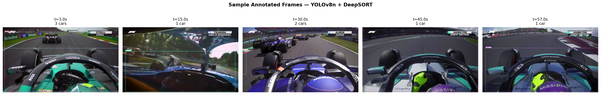

# F1 Car Detection & Tracking

<!-- Once pushed to GitHub, replace OWNER/REPO below to activate the CI badge:
[](https://github.com/OWNER/REPO/actions/workflows/ci.yml) -->


YOLOv8 + DeepSORT pipeline for detecting and tracking Formula 1 cars in race footage. Originally built for CSC 528, packaged here as a proper installable Python package with a live demo, tests, CI, and Docker support.



---

## Features

- **Detection** — YOLOv8 (COCO `car` class) per-frame.
- **Tracking** — DeepSORT with Kalman filtering + CNN re-ID, tuned to survive broadcast camera cuts.
- **Evaluation** — MOTA / IDF1 (via [py-motmetrics](https://github.com/cheind/py-motmetrics)) plus GT-free track-stability metrics (fragmentation, detection rate, short-track ratio).
- **Live demo** — Streamlit app: upload a clip, get an annotated video + stats in your browser.
- **Production scaffolding** — installable package (`pyproject.toml`), CLI console scripts, unit tests, GitHub Actions CI, Docker image.

## Project Structure

| Path | Purpose |
|---|---|
| `src/f1_tracking/detect.py` | YOLOv8 car detection wrapper |
| `src/f1_tracking/track.py` | DeepSORT tracking wrapper |
| `src/f1_tracking/visualize.py` | Draw boxes/IDs onto frames, write MP4 |
| `src/f1_tracking/evaluate.py` | MOTA / IDF1 metrics + track stability metrics |
| `src/f1_tracking/pipeline.py` | End-to-end detect → track → annotate → evaluate pipeline |
| `src/f1_tracking/cli.py` | `f1-track` CLI entry point |
| `src/f1_tracking/ground_truth.py` | Pseudo-GT generator (YOLOv8m oracle + DeepSORT) — `f1-gt` |
| `src/f1_tracking/benchmark.py` | Benchmark yolov8n vs yolov8s — `f1-compare` |
| `src/f1_tracking/analysis.py` | Generate analysis plots and sample frames — `f1-analyze` |
| `src/f1_tracking/utils.py` | Shared helpers |
| `app/streamlit_app.py` | Interactive browser demo |
| `tests/` | pytest unit tests (YOLO/DeepSORT mocked — no model download needed) |
| `notebooks/F1_Tracking_Final.ipynb` | Full local analysis notebook |

---

## Quick Start

```bash
./setup.sh              # creates .venv, installs f1-tracking + dev/app extras
source .venv/bin/activate

# Run full pipeline
f1-track --input f1_trimmed.mp4 --output result.mp4

# With pseudo-GT evaluation (MOTA / IDF1)
f1-gt --input f1_trimmed.mp4 --output annotations/gt.txt
f1-track --input f1_trimmed.mp4 --output result.mp4 --gt annotations/gt.txt

# Model comparison
f1-compare --input f1_trimmed.mp4 --frames 300

# Save analysis plots + sample frames
f1-analyze --input f1_trimmed.mp4
```

### Live demo (Streamlit)

```bash
streamlit run app/streamlit_app.py
```

Upload a clip, tune model/confidence/frame-count in the sidebar, and get an annotated video plus stats in your browser.

### Docker

```bash
docker build -t f1-tracking .
docker run -p 8501:8501 f1-tracking
# open http://localhost:8501
```

## CLI Options (`f1-track`)

```
--input        Path to input video (required)
--output       Output video path (default: output_tracked.mp4)
--model        YOLOv8 variant: yolov8n.pt / yolov8s.pt / yolov8m.pt (default: yolov8n.pt)
--conf         Detection confidence threshold (default: 0.25)
--max-frames   Process only first N frames (useful for testing)
--gt           Ground truth .txt in MOT format — enables MOTA / IDF1 reporting
--verbose      Enable debug logging
```

---

## Results

### Test clip: `f1_trimmed.mp4` — 60 seconds, 3000 frames @ 50fps, 1920×1080

#### Basic Statistics

| Metric | Value |
|---|---|
| Frames processed | 3000 |
| Total detections | 4397 |
| Unique track IDs | 25 |
| Max cars in one frame | 4 |
| Avg cars per frame | 1.47 |

#### Track Stability (no GT required)

| Metric | Value | Notes |
|---|---|---|
| Avg track length | **175.9 frames** | ~3.5s per track at 50fps — stable continuous tracking |
| Short tracks (<10f) | **0%** | No ghost tracks from motion blur |
| Detection rate | **79%** | Cars visible in 79% of frames |
| Fragmentation ratio | 6.25 | 25 IDs / 4 max cars; camera cuts create new IDs |
| ID switches | **1** | Extremely low — tracks are highly consistent |

#### MOT Metrics (pseudo-GT evaluation)

> **Note on pseudo-GT:** ground truth is generated by `f1-gt` using **YOLOv8m** (a stronger, independent detector) at high confidence as the oracle, tracked with the same DeepSORT tuning as the predictor — an earlier version of this script mistakenly reused YOLOv8n for both the oracle and the predictor, which made the GT non-independent; that's fixed as of this package restructure. The predictor still runs at conf=0.25 by default, so lower-confidence detections are counted as false positives against the higher-confidence GT — this inflates FP and suppresses MOTA. The ID switch count is the most reliable metric here, since it reflects true tracking continuity independent of the detection threshold difference.

| Metric | Value |
|---|---|
| MOTA | -404.49% (see note above) |
| IDF1 | 19.20% |
| ID Switches | **1** |
| Misses | 225 |
| False Positives | 3820 (threshold mismatch artefact) |

> For true MOTA/IDF1 scores, annotate frames manually using [CVAT](https://cvat.ai) and export in MOT format.

---

## Model Comparison: YOLOv8n vs YOLOv8s (CPU)

Benchmarked on 300 frames, conf=0.25:

| Model | Avg dets/frame | Max dets | Avg conf | Speed (CPU) |
|---|---|---|---|---|
| `yolov8n.pt` | **1.32** | 4 | 0.383 | **3.4 fps** |
| `yolov8s.pt` | 0.27 | 3 | 0.371 | 1.9 fps |

**Key finding:** YOLOv8n detects more cars than YOLOv8s at the same confidence threshold on this footage. YOLOv8s is more selective (higher precision, lower recall) and runs 1.8× slower on CPU. For F1 footage with motion blur and partial occlusion, YOLOv8n's higher recall is preferable. On a GPU, YOLOv8s would be worth evaluating for higher-quality detection.

---

## Tuning Impact

| Parameter | Before | After | Impact |
|---|---|---|---|
| `embedder_gpu` | `True` (crashed) | `False` | Fixed ReID on CPU |
| `max_age` | 30 | **70** | Tracks survive camera cuts |
| `n_init` | 3 | **5** | Eliminates ghost tracks |
| `max_cosine_distance` | 0.4 | **0.3** | Stricter ReID, fewer ID swaps |
| `conf` threshold | 0.3 | **0.25** | Better recall on fast-moving cars |

**Result:** Unique track IDs dropped from **143 → 25**, avg track length increased from ~13 → **175.9 frames**.

---

## Tuning Guide

| Parameter | Location | Default | Notes |
|---|---|---|---|
| `conf_threshold` | `detect.py` / `--conf` | 0.25 | Lower = more detections; raise to 0.5 for clean footage |
| `max_age` | `track.py` | 70 | Frames a track survives without detection; increase for camera cuts |
| `n_init` | `track.py` | 5 | Detections to confirm a new track; raise to 7 to suppress motion-blur ghosts |
| `max_cosine_distance` | `track.py` | 0.3 | ReID threshold; lower = stricter matching |

## F1-Specific Failure Modes

| Failure | Cause | Fix |
|---|---|---|
| ID swap on overtake | Overlapping cars confuse ReID | Lower `max_cosine_distance` to 0.25 |
| Track lost after camera cut | `max_age` too short | Increase `max_age` to 90 |
| Missed detections (motion blur) | Cars at 300 km/h | Switch to `yolov8s.pt` or lower `--conf` to 0.2 |
| High fragmentation ratio | Camera cuts, occlusion | Expected in broadcast footage; fragmentation ≠ tracking failure |

---

## Ground Truth Annotation

To compute unambiguous MOTA / IDF1, annotate frames using [CVAT](https://cvat.ai) (free) and export in MOT format:

```
frame_id, object_id, x, y, width, height, confidence, -1, -1, -1
```

Then:
```bash
f1-track --input clip.mp4 --gt annotations/gt.txt
```

---

## Development

```bash
pip install -e ".[dev]"
pytest -v                 # unit tests (YOLO/DeepSORT mocked, fast, no downloads)
ruff check .               # lint
black --check .            # format check
```

CI (`.github/workflows/ci.yml`) runs lint, format check, and tests on every push/PR.

## Output Files

| File | Description |
|---|---|
| `result.mp4` | Annotated output video with bounding boxes and track IDs |
| `track_analysis.png` | Cars-per-frame timeline + track length distribution |
| `sample_frames.png` | 5 annotated frames spread across the video |
| `comparison_plot.png` | YOLOv8n vs YOLOv8s detection and speed comparison |
| `annotations/gt.txt` | Pseudo-GT MOT annotations |

---

## References

- [YOLOv8 (Ultralytics)](https://github.com/ultralytics/ultralytics)
- [DeepSORT paper](https://arxiv.org/abs/1703.07402)
- [py-motmetrics](https://github.com/cheind/py-motmetrics)
- [MOT16 Benchmark](https://arxiv.org/abs/1603.00831)
